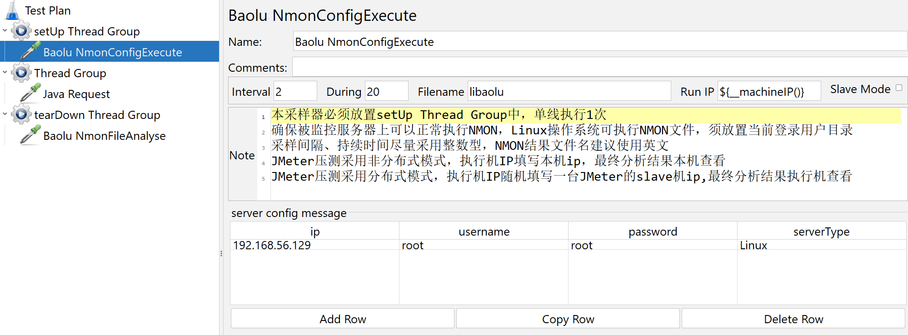
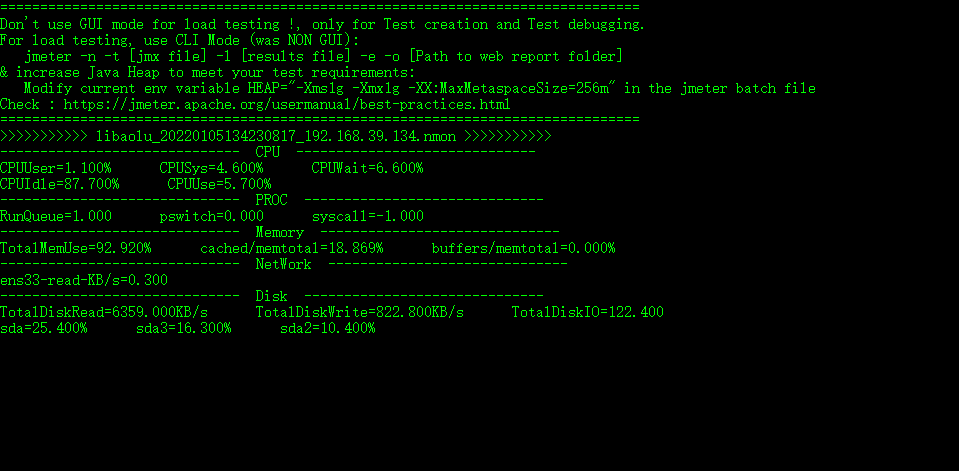

# baolu-nmon-monitor

#### 介绍
JMeter Nmon 监控工具用来监控Linux 、Aix系统资源消耗，在场景运行结束自动计算结果。

#### 安装教程

1. git clone https://gitee.com/LeeBaul/baolu-nmon-monitor.git
2. mvn package
3. copy baolu-nmon-monitor.xxx.jar to ${JMETER_HOME}/lib/ext folder
4. restarting the JMeter, you can see "BaoLu NmonFileAnalyse、BaoLu NmonConfigExecute" in JMeter's Sampler

#### 版本说明
v2.1.3 首版 
v2.1.4 全新GUI页面，测试人员更友好的配置服务器信息 
v2.1.5 修改samplerLabel，优化展示术语
v2.1.6 调整FileName优化输入框大小
v2.1.7 NmonConfigExecuteSamplerGui增加Label
#### 使用说明

1.   **BaoLu NmonConfigExecute** 

- 本采样器必须放置setUp Thread Group中，单线执行1次；
- 确保被监控服务器上可以正常NMON，Linux操作系统可执行NMON文件，须放置当前登录用户目录；
- 采样间隔、持续时间尽量采用整数型，NMON结果文件名建议使用英文；
- JMeter压测采用非分布式模式，执行机IP填写本机ip，最终分析结果本机查看；
- JMeter压测采用分布式模式，执行机IP随机填写一台JMeter的slave机ip,最终分析结果执行机IP查看。

2.   **BaoLu NmonFileAnalyse** 

- 本采样器必须放置tearDown Thread Group中，单线执行1次；
- NMON解析结果可在console/jmeter.log/jmeter-server.log中查看；
- 源NMON结果文件保存在JMeter_HOME/bin/nmonTemp目录下。

3. 截图
   

插件详细使用说明请参考： 
1.https://mp.weixin.qq.com/s/cpEnHYxm4D_LtcPmRBSHWw  
2.https://www.cnblogs.com/leebaul/p/12830645.html

#### 参与贡献

1.  Fork 本仓库
2.  新建 Feat_xxx 分支
3.  提交代码
4.  新建 Pull Request

#### 我的公众号

