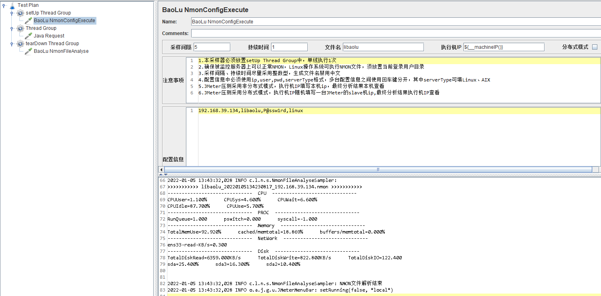

# jmeter-nmon-monitor

#### 介绍
JMeter Nmon 监控工具用来监控Linux 、Aix系统资源消耗，在场景运行结束自动计算结果。

#### 安装教程

1.  git clone https://gitee.com/LeeBaul/jmeter-nmon-monitor.git
2.  mvn package
3.  copy baolu-nmon-monitor.xxx.jar to ${JMETER_HOME}/lib/ext

#### 使用说明

1.   **BaoLu NmonConfigExecute** 

- 本采样器必须放置setUp Thread Group中，单线执行1次
- 确保被监控服务器上可以正常NMON，Linux操作系统可执行NMON文件，须放置当前登录用户目录
- 采样间隔、持续时间尽量采用整数型，生成文件名禁用中文
- 配置信息中必须使用ip,user,pwd,serverType格式，多台配置信息之间使用回车键分开，其中serverType可填Linux、AIX
- JMeter压测采用非分布式模式，执行机IP填写本机ip，最终分析结果本机查看
- JMeter压测采用分布式模式，执行机IP随机填写一台JMeter的slave机ip,最终分析结果执行机IP查看

2.   **BaoLu NmonFileAnalyse** 

- 本采样器必须放置tearDown Thread Group中，单线执行1次
- NMON解析结果可在console/jmeter.log/jmeter-server.log中查看
- 原始NMON结果文件保存在JMeter/bin/nmonTemp目录下

3.  截图

  

#### 参与贡献

1.  Fork 本仓库
2.  新建 Feat_xxx 分支
3.  提交代码
4.  新建 Pull Request

#### 我的公众号

